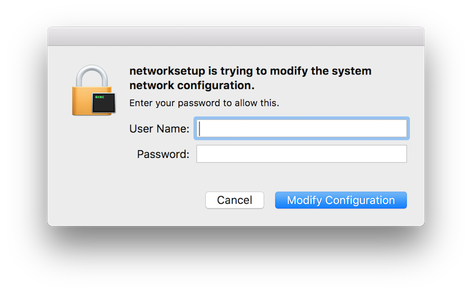

<pre>
         _           
        | |          
 ___  __| |_ __  ___ 
/ __|/ _` | '_ \/ __|
\__ \ (_| | | | \__ \
|___/\__,_|_| |_|___/
</pre>

A command-line DNS switcher for macOS. 

You could do:

    Apple Menu -> System Preferences -> Network -> Wi-Fi -> Advanced -> DNS -> [+]
    
and then manually type in your new DNS servers like a chump. Or you could just type:

    $ sdns switch google
    
and have it done for you automatically.

## Caveats

**Caveat 1:** At the moment `sdns` only works with the Wi-Fi interface.

**Caveat 2:** You'll be asked to enter your user password to make any DNS settings changes. Don't be alarmed by this, it's perfectly normal.

  

**Caveat 3:** If you don't have `networksetup` installed for some reason (the absence of which would be pretty freaky if you're on macOS), things will not go well for you. 

To check: `$ which networksetup`. You should see `/usr/sbin/networksetup`.
    
**Caveat 4:** It works on my machine.

## Installation

This is a [Crystal](https://crystal-lang.org) app. Until I make a proper release, your best bet is to install Crystal via [Homebrew](https://brew.sh), download this source code, compile it yourself, and execute the binary.

Still less effort than clicking through the Network system pref to do things.

## Usage

First, make sure you have a `dns.yaml` file in the same directory as the binary. This source comes with one configured for [Google](https://developers.google.com/speed/public-dns/), [OpenDNS](https://use.opendns.com), and [UnblockUs](https://support.unblock-us.com/customer/portal/articles/291525?_ga=1.208644567.452473323.1486340879). Extend that at your leisure.

`sdns` supports the following commands:

### current

    $ ./sdns current
    
Displays your current DNS settings. If you have custom settings configured, it'll display those:

    google:
        8.8.8.8
        8.8.4.4
        
If you don't yet have any custom settings configured, you'll see a message like:

    There aren't any DNS Servers set on Wi-Fi.
    
### default

    $ ./sdns default
    
Switched your DNS settings back to their default settings, which is likely whatever your router or ISP provide.

In other words, it deletes your custom settings.

### list

    $ ./sdns list
    
Displays a table of all the possible DNS settings you cand switch to. Available out of the box are Google, OpenDNS, and UnblockUs.

### switch <id>

    $ ./sdns switch 1
    
or

    $ ./sdns switch google
    
Switches your DNS settings to the specified provider. 

You can also use:

    $ ./sdns switch empty
    
to delete any custom settings. This is effectively the same as `./sdns default`.

## License

The project is available as open source under the terms of the [MIT License](http://opensource.org/licenses/MIT).